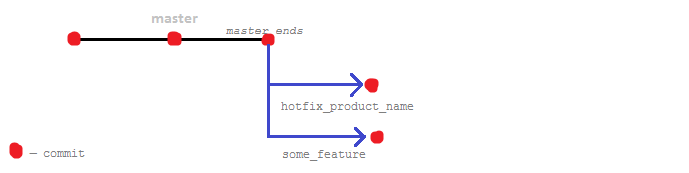
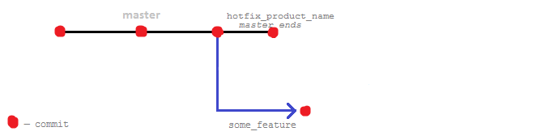

Test Geekhub project.

1. Сначала я запушил все файлы включая `vendor` и `.idea`. Чтобы не нужные папки я воспользовался:

    ```bash
    git rm -r --cached vendor
    git rm -r --cached .idea
    ```
    
    **-r** — рекурсивно, по другому директорию не удалить, для одиночного файла не нужно.
    **--cached** — удалить только закешированные элементы, из локального репозитория не будет удаленно. 

2. Сделал несколько коммитов в `master`, на основе последнего коммита сделал 2 ветки: `some_feature` и `horfix_product_name`.

    Чтобы сделать и перейти на ветку нужно:
    
    ```bash
    git checkout -b <branch_name>
    ```
    
    Это сокращение для:
    
    ```bash
    git branch <branch_name>
    git checkout <branch_name>
    ```
    
    У каждой ветки свое состояние, в PhpStorm файлы сами меняюстя в зависимости от ветки.
    
    Получилась такая картина:
    
    

3. Добавил по коммиту в каждую ветку и решил сделать слияние с `master`. 

    Для этого перешел на ветку `master`:
    
    ```bash
    git checkout master
    ```
    
    И чтобы слить: 
    
    ```bash
    git merge horfix_product_name
    ```
    
    Так как в `master` не было дальше коммитов и ветка исходила из последнего коммита в `master`, 
    то использовался принцип слияния "перемотка" (Fast forward).
    
    `horfix_product_name` слита с `master` и все еще исходид из конца `mаster`, 
    но не такая длинная как другая ветка потому что в ней теперь нет коммита:
    
    
    
    Конец ветки мастер перемотался на конец ветки `some_feature`, теперь все коммиты этой ветки принадлежат ветке `master`.
    
    После сливания, ветку нужно удалить вручную если она больше не нужна:
    
    ```bash
    git branch -d horfix_product_name
    ```
    
    Но это удаляет только локально, надо удалить удаленно по такому синтаксису:
    
    ```bash
    git push --delete <remote_name> <branch_name>
    ```
    
    То есть:
    
    ```bash
    git push --delete origin horfix_product_name
    ```
    
4. Добавил изменения в `master` и решил перейти на ветку `some_feature`. Перейти я смогу спокойно на ветку если у меня не будет 
изменений которые влияют на "dirty files" (грязные файлы). 

---

Я думал грязный файл это когда изменил файл, добавил его в staged (подготовленные), 
и потом опять изменил (`git status --short` выводит перед файлом вместо M, то есть Modified, две MM в таком случае),
но я так смог переходить по веткам, значит это не считается грязным файлом.
    
---
